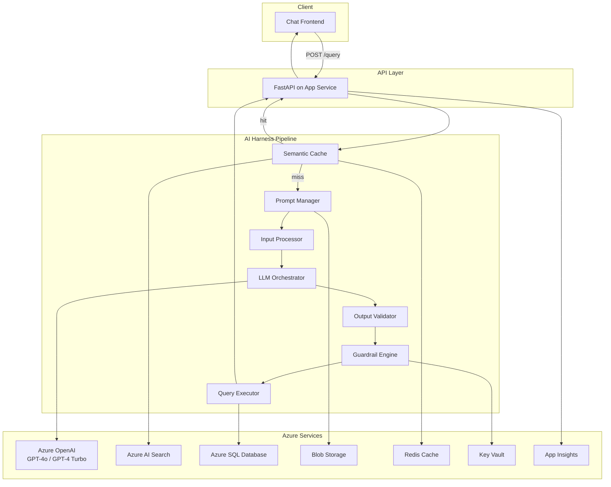

# NLP-to-SQL Azure Harness

A multi-layer AI orchestration system that converts natural language questions into validated, safe SQL queries executed against Azure SQL Database. Built with a pipeline architecture where each layer performs a distinct responsibility — from intent classification through SQL generation, validation, guardrail enforcement, and result delivery.

## Design Philosophy

- **Pipeline architecture**: Each layer (Prompt Manager → Input Processor → LLM Orchestrator → Validator → Guardrails → Executor) can be tested, replaced, and scaled independently.
- **Safety-first**: SQL injection detection, DDL/DML blocking, RBAC enforcement, PII redaction, and row caps applied before any query reaches the database.
- **Semantic caching**: Embedding-based query matching short-circuits the pipeline for semantically equivalent queries, reducing latency and cost.
- **Observable**: Every request produces a distributed trace with token usage, latency metrics, and cache hit rates via Application Insights.
- **Evaluation-driven**: Automated accuracy measurement against ground-truth datasets provides CI/CD gating (≥80% execution accuracy required).

## Architecture Overview



## Technology Stack

| Layer | Technology | Purpose |
|-------|-----------|---------|
| API | Python 3.11, FastAPI | HTTP layer, request validation |
| LLM Orchestration | LangChain, LangGraph | State machine for generation with retry/fallback |
| SQL Parsing | sqlglot | AST-based validation, safety scanning, schema conformance |
| Vector Search | Azure AI Search | Semantic cache lookups, few-shot retrieval |
| Caching | Azure Cache for Redis | Low-latency result storage with TTL |
| Database | Azure SQL Database | Business data storage and query execution |
| Storage | Azure Blob Storage | Prompt templates, schema metadata, evaluation data |
| Secrets | Azure Key Vault | Secure credential management |
| Observability | Application Insights | Distributed tracing, metrics, structured logging |
| Infrastructure | Bicep (IaC) | Declarative Azure resource provisioning |
| Frontend | HTML/CSS/JavaScript | Chat interface with paginated results |

## Prerequisites

| Requirement | Version | Notes |
|-------------|---------|-------|
| Python | 3.11+ | Required |
| Azure CLI | 2.50+ | For deployment and Key Vault access |
| Azure Subscription | — | With Azure OpenAI access approved |
| ODBC Driver 18 | Latest | For Azure SQL connectivity |
| Node.js | 18+ (optional) | Only if using frontend build tools |
| Git | 2.30+ | Source control |

## Quick Start (Local Development)

### 1. Clone and install

```bash
git clone <repository-url>
cd Az_syst
pip install -e ".[dev]"
```

### 2. Configure environment

```bash
cp .env.example .env
# Fill in values from your Azure deployment (see AZURE_SETUP.md)
```

### 3. Run the application

```bash
uvicorn src.api.main:app --reload --port 8000
```

### 4. Open the frontend

Open `frontend/index.html` in your browser, or serve it:

```bash
python -m http.server 3000 --directory frontend
```

Then visit `http://localhost:3000`.

## Environment Variables

| Variable | Required | Default | Description |
|----------|----------|---------|-------------|
| `AZURE_OPENAI_ENDPOINT` | Yes | — | Azure OpenAI service endpoint |
| `AZURE_OPENAI_API_KEY` | No* | — | API key (local dev only; production uses MI) |
| `AZURE_OPENAI_PRIMARY_DEPLOYMENT` | No | `gpt-4o` | Primary model deployment name |
| `AZURE_OPENAI_FALLBACK_DEPLOYMENT` | No | `gpt-4-turbo` | Fallback model deployment name |
| `AZURE_OPENAI_EMBEDDING_DEPLOYMENT` | No | `text-embedding-ada-002` | Embedding model deployment |
| `AZURE_SEARCH_ENDPOINT` | Yes | — | Azure AI Search endpoint |
| `AZURE_SEARCH_API_KEY` | No* | — | Search API key (local dev only) |
| `SQL_CONNECTION_STRING` | Yes | — | Azure SQL ODBC connection string |
| `REDIS_CONNECTION_STRING` | Yes | — | Redis connection string |
| `AZURE_BLOB_STORAGE_URL` | Yes | — | Blob storage endpoint |
| `AZURE_KEY_VAULT_URL` | Yes | — | Key Vault URI |
| `ROW_CAP` | No | `1000` | Maximum rows returned per query |
| `QUERY_TIMEOUT_SECONDS` | No | `30` | SQL execution timeout |
| `CACHE_TTL_SECONDS` | No | `3600` | Cache entry TTL |
| `CACHE_SIMILARITY_THRESHOLD` | No | `0.92` | Cosine similarity for cache hits |
| `MAX_RETRIES` | No | `3` | LLM generation retry limit |
| `LOG_LEVEL` | No | `info` | Logging verbosity |

*\* Not required in production when using Managed Identity*

## Evaluation Pipeline

Run the automated accuracy evaluation against ground-truth test cases:

```bash
# Run evaluation (requires Azure services running)
python evaluation/evaluate.py

# Or via the API
curl -X POST http://localhost:8000/api/v1/evaluate
```

The evaluation pipeline:
1. Loads test cases from `data/evaluation/test_cases.json` (or Blob Storage)
2. Runs each NL query through the full pipeline
3. Compares generated SQL against ground-truth (exact match + execution accuracy)
4. Reports scores to Application Insights
5. Fails CI if execution accuracy < 80%

## Example Queries

| Natural Language | Expected SQL | Tier |
|-----------------|-------------|------|
| "How many customers do we have?" | `SELECT COUNT(*) FROM customers` | Simple |
| "Show orders from last month" | `SELECT * FROM orders WHERE order_date >= DATEADD(month, -1, GETUTCDATE())` | Filtered |
| "Top 5 customers by total spend" | `SELECT TOP 5 c.first_name, c.last_name, SUM(o.total_amount) as total_spend FROM customers c JOIN orders o ON c.customer_id = o.customer_id GROUP BY c.first_name, c.last_name ORDER BY total_spend DESC` | Join |
| "Campaign ROI this quarter" | `SELECT ca.name, ca.budget, SUM(cc.revenue) as total_revenue, (SUM(cc.revenue) - ca.budget) / ca.budget * 100 as roi_pct FROM campaigns ca JOIN campaign_conversions cc ON ca.campaign_id = cc.campaign_id WHERE cc.conversion_date >= DATEADD(quarter, DATEDIFF(quarter, 0, GETUTCDATE()), 0) GROUP BY ca.name, ca.budget` | Advanced |

## Azure Cost Estimation

Estimated monthly costs for moderate usage (~1000 queries/day):

| Service | SKU | Estimated Cost |
|---------|-----|---------------|
| Azure OpenAI (GPT-4o) | Standard, 30K TPM | ~$60–100/mo |
| Azure OpenAI (Embeddings) | Standard, 30K TPM | ~$5–10/mo |
| Azure AI Search | Basic | ~$70/mo |
| Azure SQL Database | Basic (5 DTU) | ~$5/mo |
| Azure App Service | B1 Linux | ~$13/mo |
| Azure Cache for Redis | Basic C0 | ~$16/mo |
| Azure Blob Storage | Standard LRS | ~$1–2/mo |
| Azure Key Vault | Standard | ~$0.03/mo |
| Application Insights | Pay-as-you-go | ~$5–10/mo |
| **Total** | | **~$150–225/mo** |

> Production workloads (10K+ queries/day) with higher SKUs: estimate $250–400/month.

## Known Limitations

- **English only**: NL understanding and prompt templates assume English input.
- **T-SQL dialect**: Generated SQL targets Azure SQL Database (T-SQL); PostgreSQL support is partial.
- **No real-time schema updates**: Schema metadata is polled from Blob Storage every 60s; DDL changes require a metadata file update.
- **Row cap applied unconditionally**: All queries are capped at 1000 rows regardless of user intent.
- **Basic RBAC**: Role-based access is table-level only; no column-level or row-level security.
- **CLU dependency optional**: Without Azure AI Language (CLU), intent classification falls back to keyword heuristics (lower accuracy).
- **No streaming**: Responses are returned as a single payload; streaming for large result sets is not yet supported.

## Production Roadmap

- [ ] Column-level and row-level security in guardrails
- [ ] Support for PostgreSQL and MySQL dialects
- [ ] Streaming response for large result sets
- [ ] Azure AD B2C integration for end-user authentication
- [ ] Automated schema metadata sync from SQL Database directly
- [ ] Fine-tuned smaller models for cost reduction
- [ ] Query explanation generation (natural language summary of SQL)
- [ ] Admin dashboard for monitoring and prompt management
- [ ] A/B testing framework for prompt versions

## Project Structure

```
Az_syst/
├── frontend/           # Chat UI (HTML/CSS/JS)
├── infra/              # Bicep IaC templates
├── src/
│   ├── api/            # FastAPI application
│   ├── harness/        # Pipeline components (11 layers)
│   ├── nlp_to_sql/     # Core models and configuration
│   └── schema/         # Schema metadata manager
├── data/
│   ├── seed/           # SQL seed scripts
│   ├── evaluation/     # Ground-truth test cases
│   └── schema_metadata.json
├── prompts/            # Prompt templates and metadata
├── evaluation/         # Evaluation pipeline
├── docs/               # Architecture documentation
├── AZURE_SETUP.md      # Deployment guide
└── README.md
```

## Contributing

1. Create a feature branch from `main`
2. Follow existing code patterns (Pydantic models, type hints, async/await)
3. Ensure evaluation pipeline passes (≥80% accuracy)
4. Submit a PR with description of changes

## License

Internal project — see repository settings for access policies.
