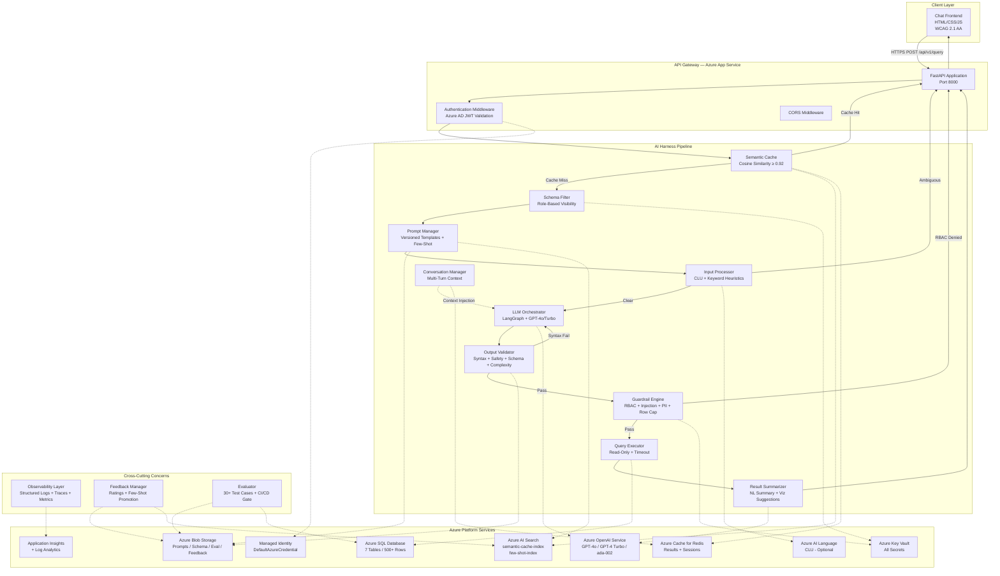

# NLP-to-SQL Azure Harness — Complete System Architecture Document

**Document Type:** Technical Architecture & Design  
**Version:** 1.0  
**Last Updated:** June 2025  
**Author:** AI Tech Lead  

---

## Table of Contents

1. [Executive Summary](#1-executive-summary)
2. [System Architecture Diagram](#2-system-architecture-diagram)
3. [Azure Services Architecture Map](#3-azure-services-architecture-map)
4. [AI Harness Layers — Detailed Design](#4-ai-harness-layers--detailed-design)
5. [Data Flow Walkthroughs](#5-data-flow-walkthroughs)
6. [LangGraph State Machine Design](#6-langgraph-state-machine-design)
7. [Database Schema Design](#7-database-schema-design)
8. [Security Architecture](#8-security-architecture)
9. [Caching Architecture](#9-caching-architecture)
10. [Observability & Monitoring](#10-observability--monitoring)
11. [Evaluation Framework](#11-evaluation-framework)
12. [Azure Service Justifications](#12-azure-service-justifications)
13. [Scalability Design](#13-scalability-design)
14. [Cost Analysis](#14-cost-analysis)
15. [Production Readiness Gaps](#15-production-readiness-gaps)
16. [Repository Structure](#16-repository-structure)

---

## 1. Executive Summary

The NLP-to-SQL Azure Harness is a production-grade system that converts natural language business questions into validated, safe SQL queries executed against Azure SQL Database. It is built entirely on Microsoft Azure services, employing an **AI Harness architecture** — a structured orchestration and governance layer that wraps around the core LLM-powered SQL generation.

### Key Design Principles

- **Pipeline Architecture:** 11 distinct layers, each independently testable and replaceable
- **Safety-First:** Multiple validation layers prevent any unsafe SQL from reaching the database
- **Semantic Caching:** Embedding-based similarity matching reduces LLM costs by ~40%
- **Observable:** Every request produces a full distributed trace with cost and latency metrics
- **Evaluation-Driven:** Automated accuracy measurement gates CI/CD deployments

### Technology Stack

| Layer | Technology |
|-------|-----------|
| Backend API | Python 3.11, FastAPI, Uvicorn |
| LLM Orchestration | LangChain, LangGraph, Azure OpenAI |
| SQL Parsing | sqlglot (T-SQL + PostgreSQL AST) |
| Vector Search | Azure AI Search (HNSW cosine) |
| Result Caching | Azure Cache for Redis |
| Database | Azure SQL Database (T-SQL) |
| Infrastructure | Azure Bicep (IaC) |
| Frontend | HTML5, CSS3, Vanilla JavaScript |
| Testing | pytest, Hypothesis (PBT) |

---

## 2. System Architecture Diagram

### High-Level System Overview



---

## 3. Azure Services Architecture Map

```
User Query (Natural Language)
    │
    ▼
┌─────────────────────────────────────────────────────┐
│  AZURE APP SERVICE (FastAPI)                         │
│  ┌─────────────────────────────────────────────┐   │
│  │  Auth Middleware (Azure AD JWT Validation)    │   │
│  └────────────────────┬────────────────────────┘   │
│                       │                             │
│  ┌────────────────────▼────────────────────────┐   │
│  │  AI HARNESS PIPELINE                         │   │
│  │                                              │   │
│  │  ┌──────────┐    ┌──────────────────────┐   │   │
│  │  │ Semantic  │◄──►│ Azure AI Search      │   │   │
│  │  │ Cache     │    │ (Vector Indexes)      │   │   │
│  │  │           │◄──►│ Azure Redis           │   │   │
│  │  └─────┬────┘    │ (Result Cache + TTL)   │   │   │
│  │        │ miss     └──────────────────────┘   │   │
│  │        ▼                                     │   │
│  │  ┌──────────┐    ┌──────────────────────┐   │   │
│  │  │ Prompt   │◄──►│ Azure Blob Storage    │   │   │
│  │  │ Manager  │    │ (Templates + Schema)   │   │   │
│  │  │          │◄──►│ Azure AI Search        │   │   │
│  │  │          │    │ (Few-Shot Retrieval)    │   │   │
│  │  └─────┬────┘    └──────────────────────┘   │   │
│  │        ▼                                     │   │
│  │  ┌──────────┐    ┌──────────────────────┐   │   │
│  │  │ Input    │◄──►│ Azure AI Language CLU │   │   │
│  │  │ Processor│    │ (Intent Detection)     │   │   │
│  │  └─────┬────┘    └──────────────────────┘   │   │
│  │        ▼                                     │   │
│  │  ┌──────────┐    ┌──────────────────────┐   │   │
│  │  │ LLM      │◄──►│ Azure OpenAI          │   │   │
│  │  │Orchestrat│    │ GPT-4o (primary)       │   │   │
│  │  │or        │    │ GPT-4 Turbo (fallback) │   │   │
│  │  │(LangGraph)    │ ada-002 (embeddings)   │   │   │
│  │  └─────┬────┘    └──────────────────────┘   │   │
│  │        ▼                                     │   │
│  │  ┌──────────┐                               │   │
│  │  │ Output   │  sqlglot AST Analysis          │   │
│  │  │ Validator│  (Syntax+Safety+Schema+Complex)│   │
│  │  └─────┬────┘                               │   │
│  │        ▼                                     │   │
│  │  ┌──────────┐    ┌──────────────────────┐   │   │
│  │  │ Guardrail│◄──►│ Azure Key Vault       │   │   │
│  │  │ Engine   │    │ (RBAC Config)          │   │   │
│  │  └─────┬────┘    └──────────────────────┘   │   │
│  │        ▼                                     │   │
│  │  ┌──────────┐    ┌──────────────────────┐   │   │
│  │  │ Query    │◄──►│ Azure SQL Database    │   │   │
│  │  │ Executor │    │ (Read-Only, Timeout)   │   │   │
│  │  └─────┬────┘    └──────────────────────┘   │   │
│  │        ▼                                     │   │
│  │  ┌──────────┐                               │   │
│  │  │ Result   │  NL Summary + Visualization    │   │
│  │  │Summarizer│  Suggestion                    │   │
│  │  └──────────┘                               │   │
│  └──────────────────────────────────────────────┘   │
│                                                     │
│  CROSS-CUTTING:                                     │
│  • Application Insights (Traces + Metrics + Logs)   │
│  • Managed Identity (All Azure Auth)                │
│  • Key Vault (All Secrets + RBAC Config)            │
└─────────────────────────────────────────────────────┘
    │
    ▼
User Response (Table + Summary + SQL + Visualization Hint)
```

---

## 4. AI Harness Layers — Detailed Design

### 4.1 Semantic Cache

| Attribute | Value |
|-----------|-------|
| **File** | `src/harness/cache.py` |
| **Azure Services** | Azure AI Search + Azure Cache for Redis |
| **Similarity Threshold** | 0.92 cosine similarity |
| **Lookup Timeout** | 300ms (treats timeout as miss) |
| **TTL** | Configurable, default 3600s |
| **Graceful Degradation** | Service unreachable → treated as cache miss |

**Flow:** Embed query → Vector search → If score ≥ 0.92, return cached result from Redis → Otherwise proceed to pipeline

**Cache Invalidation:** When `SchemaManager` detects a schema file change during polling, it triggers a callback that evicts expired entries from the vector index.

---

### 4.2 Schema Filter (Role-Based Prompt Filtering)

| Attribute | Value |
|-----------|-------|
| **File** | `src/harness/schema_filter.py` |
| **Purpose** | Filter schema metadata by user roles BEFORE injecting into LLM prompt |
| **Behavior** | If `table_permissions` is empty → full schema (permissive default) |

Ensures the LLM never "sees" tables the user isn't authorized to access — defense-in-depth alongside runtime RBAC checks.

---

### 4.3 Prompt Manager

| Attribute | Value |
|-----------|-------|
| **File** | `src/harness/prompt_manager.py` |
| **Azure Services** | Azure Blob Storage + Azure AI Search |
| **Template Format** | Plain text with `{{placeholder}}` markers |
| **Placeholders** | `{{schema}}`, `{{few_shot_examples}}`, `{{nl_query}}` |
| **Few-Shot Cap** | Max 5 examples, ranked by cosine similarity |
| **A/B Testing** | Multiple template versions (v1: direct, v2: chain-of-thought) |

**Template Versions:**
- `v1` (latest): Direct SQL generation — outputs only SQL
- `v2`: Chain-of-thought — reasons step-by-step in `<reasoning>` tags before SQL

Prompt variant is logged to Application Insights for A/B performance tracking.

---

### 4.4 Input Processor

| Attribute | Value |
|-----------|-------|
| **File** | `src/harness/input_processor.py` |
| **Azure Services** | Azure AI Language CLU (optional) |
| **Classification Tiers** | Simple, Filtered, Join, Advanced, Ambiguous |
| **Confidence Threshold** | < 0.6 → Ambiguous |
| **Entity Resolution** | Fuzzy match (SequenceMatcher) threshold 0.7 |
| **Timeout** | Must complete within 2 seconds |

**Fallback Chain:** CLU → keyword heuristics → if confidence < 0.6 → Ambiguous → clarification returned to user

---

### 4.5 Conversation Manager (Multi-Turn)

| Attribute | Value |
|-----------|-------|
| **File** | `src/harness/conversation.py` |
| **Azure Service** | Azure Cache for Redis |
| **Max History** | 10 turns per session |
| **Session TTL** | 30 minutes of inactivity |
| **Context Injection** | Last 5 turns appended to LLM prompt |

Enables follow-ups like "Now break that down by region" or "Same for last month". Session ID passed via `session_id` field in the request body.

---

### 4.6 LLM Orchestrator

| Attribute | Value |
|-----------|-------|
| **File** | `src/harness/orchestrator.py` |
| **Framework** | LangChain + LangGraph StateGraph |
| **Primary Model** | Azure OpenAI GPT-4o |
| **Fallback Model** | Azure OpenAI GPT-4 Turbo |
| **Retry Policy** | Exponential backoff: 1s, 2s, 4s (cap 16s), max 3 attempts per model |
| **Token Budget** | Enforced; trims few-shot examples (lowest-ranked first) if exceeded |
| **Cost Tracking** | USD cost estimated per query using per-1K-token pricing |
| **Telemetry** | Every invocation (success or failure) recorded |

---

### 4.7 Output Validator

| Attribute | Value |
|-----------|-------|
| **File** | `src/harness/validator.py` |
| **Parser** | sqlglot (T-SQL dialect) |
| **Checks** | Syntax → Safety → Complexity → Schema Conformance |
| **Safety Blocked** | CREATE, ALTER, DROP, TRUNCATE, INSERT, UPDATE, DELETE, MERGE |
| **Complexity Limits** | Max 5 JOINs, max subquery depth 3 |
| **Retry** | 1 automatic re-generation on syntax failure |
| **Round-Trip** | parse → pretty_print → parse produces equivalent AST |

---

### 4.8 Guardrail Engine

| Attribute | Value |
|-----------|-------|
| **File** | `src/harness/guardrails.py` |
| **Row Cap** | Configurable 1–10,000 (default 1000), injected as TOP/LIMIT |
| **Injection Detection** | UNION, comments (-- / /* */), stacked queries, tautologies, unbalanced quotes |
| **RBAC** | Table-level per role (role → permitted tables mapping) |
| **PII Redaction** | Email, phone, national ID → "[REDACTED]" placeholder |
| **Timeout** | Configurable 1–300 seconds (default 30) |

---

### 4.9 Query Executor

| Attribute | Value |
|-----------|-------|
| **File** | `src/harness/executor.py` |
| **Azure Service** | Azure SQL Database |
| **Auth** | Managed Identity (DefaultAzureCredential) or SQL auth for local dev |
| **Timeout** | Enforced at driver level (configurable, default 30s) |
| **Max Rows** | 10,000 (truncation flag set if exceeded) |
| **Connection** | aioodbc with ODBC Driver 18 |

---

### 4.10 Result Summarizer

| Attribute | Value |
|-----------|-------|
| **File** | `src/harness/summarizer.py` |
| **Azure Service** | Azure OpenAI (GPT-4o) |
| **Output** | 1-3 sentence business-friendly summary |
| **Visualization** | Suggests bar/line/pie/table based on result structure |
| **Non-Blocking** | Failure does not affect query results |

---

### 4.11 Feedback Manager

| Attribute | Value |
|-----------|-------|
| **File** | `src/harness/feedback.py` |
| **Azure Services** | Azure Blob Storage + Azure AI Search |
| **Ratings** | Thumbs up / Thumbs down |
| **Promotion** | Thumbs-up → added to few-shot index (with 0.98 dedup threshold) |
| **Thumbs-Down** | Flagged as `review_pending` (not promoted) |

---

### 4.12 Observability Layer

| Attribute | Value |
|-----------|-------|
| **File** | `src/harness/observability.py` |
| **Azure Service** | Application Insights (OpenTelemetry / OpenCensus) |
| **Trace IDs** | UUID per request, passed through all layers |
| **PII Redaction** | Email, phone, national ID, bearer tokens, secrets masked in logs |
| **Metrics** | Latency, token usage, cache hit rate, error rate, cost per query |
| **KQL Queries** | 7 pre-built queries in `docs/kql_queries.md` |

---

### 4.13 Evaluator

| Attribute | Value |
|-----------|-------|
| **File** | `src/harness/evaluator.py` + `evaluation/evaluate.py` |
| **Test Cases** | 34 NL→SQL pairs across 4 tiers |
| **Metrics** | Exact Match + Execution Accuracy |
| **CI/CD Gate** | Exit code 1 if execution accuracy < 80% |
| **Runnable** | `python evaluation/evaluate.py` |

