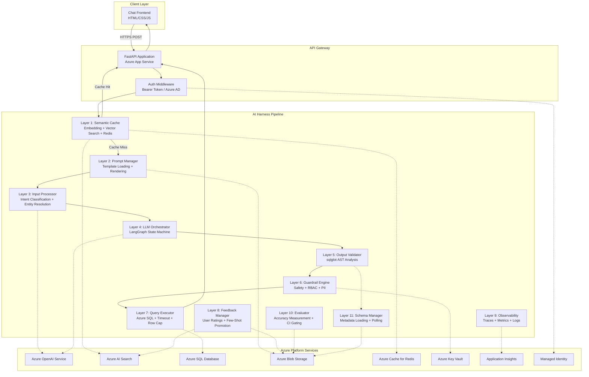

# Architecture Document

## System Architecture

The NLP-to-SQL Azure Harness follows a layered pipeline architecture. Each request flows through a series of stages, each with a single responsibility and well-defined interface. This design enables independent testing, replacement, and scaling of each component.



## Component Descriptions

### Layer 1: Semantic Cache

**Purpose:** Short-circuit the pipeline for semantically equivalent queries.

**How it works:**
1. Embeds the incoming NL query using `text-embedding-ada-002`
2. Performs a vector search against Azure AI Search (`semantic-cache-index`)
3. If cosine similarity ≥ 0.92, returns the cached result from Redis
4. If cache miss, passes through to the pipeline; stores results on completion

**Technology:** Azure AI Search (vector index) + Azure Cache for Redis (result storage with TTL)

**Key decisions:**
- 0.92 threshold balances hit rate (~40% expected) against false-positive risk
- Redis TTL (1 hour default) ensures stale data expires naturally
- Vector search timeout capped at 300ms to avoid adding latency on misses

---

### Layer 2: Prompt Manager

**Purpose:** Load, version, cache, and render prompt templates.

**How it works:**
1. Loads templates from Blob Storage at startup
2. Retrieves few-shot examples via vector similarity search
3. Renders the template with schema metadata, few-shot examples, and the NL query

**Technology:** Azure Blob Storage + Azure AI Search (few-shot index)

**Key decisions:**
- Templates are cached in memory with Blob polling (60s interval) for hot reloads
- Few-shot retrieval capped at 5 examples (balances context usage vs. accuracy)
- Placeholder validation ensures no unsubstituted markers reach the LLM

---

### Layer 3: Input Processor

**Purpose:** Classify query complexity and resolve entity references.

**How it works:**
1. Classifies the query into one of 5 tiers: Simple, Filtered, Join, Advanced, Ambiguous
2. Resolves unrecognized terms against schema metadata using fuzzy matching (threshold 0.7)
3. If confidence < 0.6 or fuzzy match fails, returns a clarification prompt to the user

**Technology:** Azure AI Language CLU (optional) with keyword heuristic fallback

**Key decisions:**
- CLU is optional — system degrades gracefully to keyword heuristics
- 0.7 fuzzy match threshold prevents incorrect entity substitution
- Ambiguous queries return a clarification prompt rather than guessing

---

### Layer 4: LLM Orchestrator

**Purpose:** Generate SQL from rendered prompts using Azure OpenAI.

**How it works:**
1. Implements a LangGraph state machine with generation → validation → retry loop
2. Primary model: GPT-4o; fallback: GPT-4 Turbo (on rate limit or failure)
3. Exponential backoff with jitter: 1s, 2s, 4s (capped at 16s)
4. Token budget management: trims few-shot examples if prompt exceeds context window

**Technology:** LangChain + LangGraph + Azure OpenAI

**Key decisions:**
- State machine pattern gives explicit control over retry/fallback logic
- Max 2 regeneration attempts before rejecting (prevents infinite loops)
- Token budget trimming removes lowest-similarity examples first

---

### Layer 5: Output Validator

**Purpose:** Ensure generated SQL is syntactically correct, safe, and schema-compliant.

**How it works:**
1. Parses SQL into AST using sqlglot (T-SQL dialect)
2. Checks for DDL/DML statements (CREATE, DROP, INSERT, UPDATE, DELETE, etc.)
3. Verifies all table/column references exist in schema metadata
4. On failure: sends error feedback to the Orchestrator for regeneration (max 1 retry)

**Technology:** sqlglot (AST parsing, round-trip normalization)

**Key decisions:**
- AST-level analysis is more reliable than regex for safety checking
- sqlglot supports T-SQL and PostgreSQL for future dialect expansion
- Normalized SQL (pretty-printed) is stored in cache and shown to users

---

### Layer 6: Guardrail Engine

**Purpose:** Enforce security policies before query execution.

**How it works:**
1. **Row cap injection:** Adds `TOP N` clause to prevent large result sets
2. **Injection detection:** Scans for UNION, comment sequences, stacked queries, tautologies
3. **RBAC enforcement:** Verifies user roles grant access to all referenced tables
4. **PII redaction:** Scans query results for email, phone, national ID patterns and masks them
5. **Timeout enforcement:** Sets query execution timeout

**Technology:** sqlglot (row cap injection) + regex patterns + Key Vault (RBAC config)

**Key decisions:**
- Row cap applied unconditionally (defense in depth against runaway queries)
- Injection patterns are defense-in-depth — primary protection is AST validation
- PII redaction uses regex patterns (email, phone, SSN/national ID formats)

---

### Layer 7: Query Executor

**Purpose:** Execute validated SQL against Azure SQL Database and return results.

**Technology:** pyodbc + Azure SQL Database with Managed Identity authentication

**Key decisions:**
- Connection pooling for performance
- Query timeout enforced at the database driver level
- Results serialized as list of dictionaries with column type metadata

---

### Layer 8: Feedback Manager

**Purpose:** Store user feedback and promote high-quality examples.

**How it works:**
1. Stores thumbs up/down feedback in Blob Storage
2. On thumbs-up: promotes the NL→SQL pair to the few-shot index (with dedup at 0.98 similarity)
3. On thumbs-down: flags for human review

**Technology:** Azure Blob Storage + Azure AI Search

---

### Layer 9: Observability Layer

**Purpose:** Structured logging, distributed tracing, and metrics.

**Metrics tracked:**
- Query latency (p50, p95, p99)
- Cache hit rate
- Token usage per request
- Error rates by type
- Model fallback frequency

**Technology:** Application Insights + OpenCensus

---

### Layer 10: Evaluator

**Purpose:** Automated accuracy measurement for CI/CD gating.

**Metrics:**
- **Exact match score:** Normalized SQL string comparison
- **Execution accuracy:** Compare result sets (column names, row counts)

**Threshold:** ≥80% execution accuracy required to pass

**Technology:** Ground-truth dataset (30+ test cases) stored in Blob Storage

---

### Layer 11: Schema Metadata Manager

**Purpose:** Load and cache database schema information for prompt rendering and validation.

**How it works:**
1. Loads `schema_metadata.json` from Blob Storage at startup
2. Polls for changes every 60 seconds (checks last-modified header)
3. On failure, retains stale metadata and logs a warning

**Technology:** Azure Blob Storage

---

## Azure Service Justifications

| Service | Why This Service | Alternatives Considered |
|---------|-----------------|------------------------|
| Azure OpenAI | Enterprise-grade GPT-4o access with content filtering, Azure AD auth | OpenAI direct API (no private networking, no MI) |
| Azure AI Search | Native vector search + keyword hybrid, managed infrastructure | Pinecone (external vendor), pgvector (requires PG setup) |
| Azure SQL Database | T-SQL compatibility, managed backups, Managed Identity auth | PostgreSQL Flexible Server (different dialect), Cosmos DB (no SQL) |
| Azure Blob Storage | Cheap, durable storage for templates/metadata; native Azure SDK | Azure Files (overkill), Cosmos DB (expensive for static data) |
| Azure Cache for Redis | Sub-millisecond latency for cached results, built-in TTL | In-memory dict (no persistence across restarts) |
| Key Vault | Centralized secret management, RBAC, audit logging | Environment variables (no rotation, no audit), Azure App Config (no encryption at rest for secrets) |
| App Service | Managed PaaS with auto-restart, deployment slots, MI support | AKS (overkill for single service), Azure Functions (cold starts hurt latency) |
| Application Insights | Native distributed tracing, custom metrics, log analytics | Datadog (additional vendor), ELK (self-managed) |
| Managed Identity | Passwordless auth to all Azure services, auto-rotation | Service principal + client secret (requires rotation) |

---

## Data Flow

### Happy Path

```
1. User submits: "Show me top 5 customers by revenue"
2. API validates input (length: 1-2000, non-empty)
3. Semantic Cache: embed query → vector search → miss
4. Prompt Manager: load template v1, retrieve 3 few-shot examples
5. Input Processor: classify as "Join" tier (confidence 0.85)
6. LLM Orchestrator: generate SQL via GPT-4o (attempt 1)
7. Output Validator: parse AST → no DDL → schema check passes
8. Guardrail Engine: inject TOP 1000, no injection patterns, RBAC pass
9. Query Executor: execute against SQL DB → 5 rows returned
10. Guardrail Engine: PII scan results → no PII found
11. Semantic Cache: store embedding + SQL + results (TTL: 3600s)
12. Observability: log trace (latency: 2.3s, tokens: 1,240)
13. API returns: {columns, rows, sql, cache_hit: false, trace_id}
```

### Error Path — Validation Failure

```
1. User submits: "Delete all customer data"
2. API validates input → passes (valid text)
3. Semantic Cache: miss
4. Prompt Manager + Input Processor: classify as "Simple"
5. LLM Orchestrator: generates "DELETE FROM customers"
6. Output Validator: detects DDL/DML (DELETE) → REJECTS
7. Orchestrator: regeneration attempt with error feedback
8. LLM generates: "SELECT * FROM customers" (misinterpretation)
9. Output Validator: passes (valid SELECT)
10. Guardrail Engine: passes
11. Result returned (safe query only)
```

### Error Path — Ambiguous Query

```
1. User submits: "revenue stuff"
2. Input Processor: confidence 0.4 (below 0.6 threshold) → Ambiguous
3. API returns: {clarification_prompt: "Could you specify which revenue metric..."}
```

---

## Scalability Considerations

| Dimension | Current (Dev) | Production Scale |
|-----------|--------------|-----------------|
| App Service | B1 (1 core, 1.75 GB) | P1v3 or P2v3 with auto-scale |
| SQL Database | Basic (5 DTU) | S2/S3 with read replicas |
| Redis | Basic C0 (250 MB) | Standard C1+ with clustering |
| AI Search | Basic (1 replica) | Standard with 2+ replicas |
| OpenAI | 30K TPM | 100K+ TPM with PTU for consistent latency |
| Concurrency | ~10 concurrent users | 100+ with connection pooling |

### Scaling strategies:
- **Horizontal:** App Service auto-scale based on CPU/memory
- **Caching:** Higher cache hit rates reduce downstream load (target 40%+ hit rate)
- **Connection pooling:** Pre-warmed database connections
- **Rate limiting:** Per-user and global rate limits on the API
- **Async processing:** Background tasks for feedback promotion and evaluation

---

## Security & Compliance

### Authentication & Authorization
- **Service-to-service:** Managed Identity (no credentials in code)
- **User authentication:** Bearer token validation (Azure AD)
- **RBAC:** Table-level access control per user role

### Data Protection
- **In transit:** TLS 1.2+ enforced on all services
- **At rest:** Azure-managed encryption (AES-256)
- **PII handling:** Automatic redaction in results and logs
- **Key management:** All secrets in Key Vault, no hardcoded credentials

### Network Security (Production)
- Private endpoints for SQL, Redis, Key Vault, Storage
- VNet integration for App Service
- NSG rules restricting inbound to App Gateway only
- Azure Front Door for DDoS protection + WAF

### Audit & Compliance
- Key Vault access logging enabled
- Application Insights captures all API requests (with PII redacted)
- SQL Database auditing for query execution
- Soft delete enabled on Key Vault

---

## Cost Estimation Breakdown

### Development Environment (~$150–225/month)

| Service | SKU | Monthly Cost |
|---------|-----|-------------|
| Azure OpenAI (GPT-4o, 30K TPM) | S0 Standard | $60–100 |
| Azure OpenAI (Embeddings) | S0 Standard | $5–10 |
| Azure AI Search | Basic | $70 |
| Azure SQL Database | Basic (5 DTU) | $5 |
| App Service | B1 Linux | $13 |
| Redis Cache | Basic C0 | $16 |
| Blob Storage | Standard LRS | $1–2 |
| Key Vault | Standard | <$1 |
| Application Insights | 5 GB/month | $5–10 |

### Production Environment (~$400–700/month)

| Service | SKU | Monthly Cost |
|---------|-----|-------------|
| Azure OpenAI (GPT-4o, 100K TPM) | S0 Standard | $150–250 |
| Azure OpenAI (Embeddings) | S0 Standard | $10–20 |
| Azure AI Search | Standard S1 | $250 |
| Azure SQL Database | S2 (50 DTU) | $75 |
| App Service | P1v3 | $80 |
| Redis Cache | Standard C1 | $45 |
| Blob Storage | Standard LRS | $2–5 |
| Key Vault | Standard | <$1 |
| Application Insights | 20 GB/month | $40–60 |
| Private Endpoints | 5 endpoints | $35 |

---

## Production Readiness Gaps

| Gap | Priority | Effort | Description |
|-----|----------|--------|-------------|
| Private networking | High | Medium | Deploy private endpoints, VNet integration |
| Multi-turn context | High | High | Session state management, conversation history |
| Rate limiting | High | Low | Per-user and global rate limits |
| Health probes | Medium | Low | Deep health checks (DB, Redis, OpenAI connectivity) |
| Blue-green deployment | Medium | Medium | Deployment slots with traffic splitting |
| Backup & DR | Medium | Medium | Geo-redundant SQL backup, Redis persistence |
| Column-level RBAC | Medium | High | Fine-grained access control beyond table-level |
| Query explanation | Low | Medium | NL summary of generated SQL for user understanding |
| Multi-language | Low | High | Support for non-English queries |
| Cost alerting | Low | Low | Azure budget alerts and anomaly detection |
